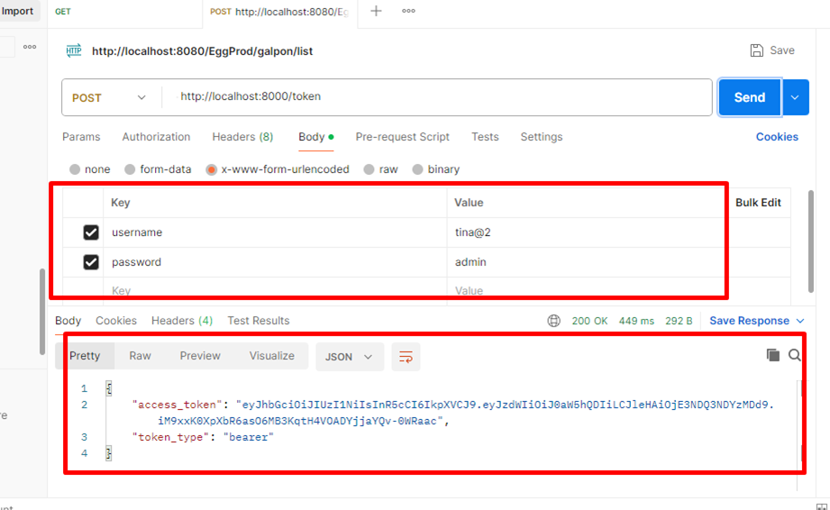
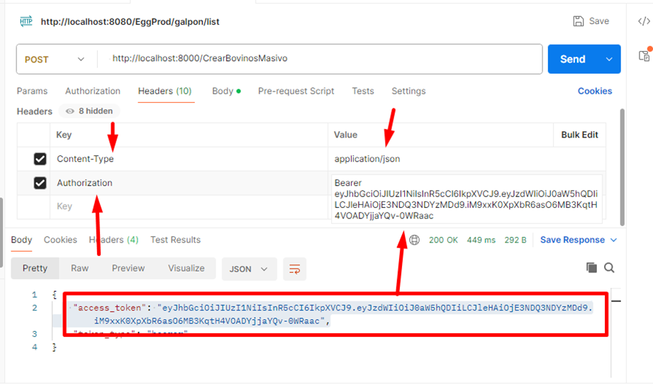

# Documentación: Función de Registro de Pesaje de Bovinos

## Requerimiento:

Esta función permite almacenar, organizar y gestionar los registros de peso de bovinos en un formato estructurado (JSON), facilitando el seguimiento del crecimiento y salud del ganado.
## Alcance / Objetivo:

Almacena datos clave: nombre del bovino, fecha de pesaje y peso

Utiliza formato estándar para fechas (AAAA-MM-DD)

Permite pesos con decimales (usando punto como separador)

Mantiene consistencia en el formato de nombres de animales


## Rama:

 - Main

## Ajustes Modelo de Base de datos

- N/A
## Requerimientos/Módulos Afectados

- No Aplica 

## Resultado Esperado / Modo de Funcionamiento:


Solicita un token para realizar la autenticación  del usuario a realizar el cargue de la información 



Seguidamente agrega la URL con la API que realizará el cargue de la información para este caso puntual 
**CargarPesoMasivo**



el formato para realizar el cargue de la información 

el el siguiente  ```[
  {
    "nombre_bovino": "10-B",
    "fecha_pesaje": "2024-05-15",
    "peso":  486 
  },
  {
    "nombre_bovino": "10-R",
    "fecha_pesaje": "2024-05-18",
    "peso":  368
  }
]``` Agrega lios campos que sean pertinentes 