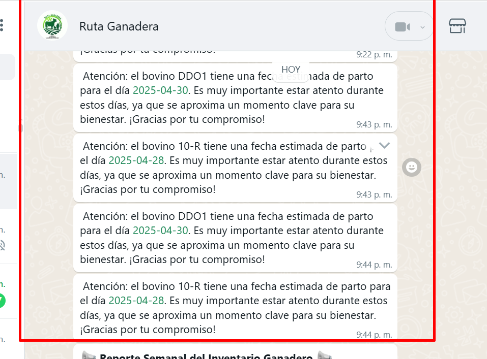

# 🐄 Mejora: Envío de Notificaciones de Próximos Partos vía WhatsApp

## 📌 Requerimiento

Como usuarios, es importante mantenernos informados sobre los partos programados en el hato ganadero.  
Por ello, se requiere implementar un sistema que envíe notificaciones automáticas de los próximos partos a través de **WhatsApp**.

## 🎯 Alcance / Objetivo

Se debe mejorar el módulo actual para que permita el envío de notificaciones mediante **WhatsApp**, de forma eficiente y clara.

## 🌿 Rama

- `main`

## 🗃️ Ajustes en el Modelo de Base de Datos

- Se requiere aplicar el ajuste correspondiente a la versión **1.5.3** del modelo de base de datos.

## 🧩 Módulos Afectados / Requerimientos Técnicos

- Módulo de **Administrador**.
- Se ajusta de acuerdo a #57 In odvr/sinarca_backend;
- Actualización del **Frontend** a la versión **1.6.0**, se agrega Campo donde se evidencia el codigo del pais para envio de notificaciones.
- ✅ *No se contemplan afectaciones para los usuarios finales.*

## ✅ Resultado Esperado / Modo de Funcionamiento

1. Los usuarios recibirán mensajes en **WhatsApp** con información sobre los próximos partos.  
2. Ejemplo del mensaje a recibir:  
   
3. En el **panel del administrador** se agregará un botón que permitirá **disparar manualmente** las notificaciones diarias.

---

