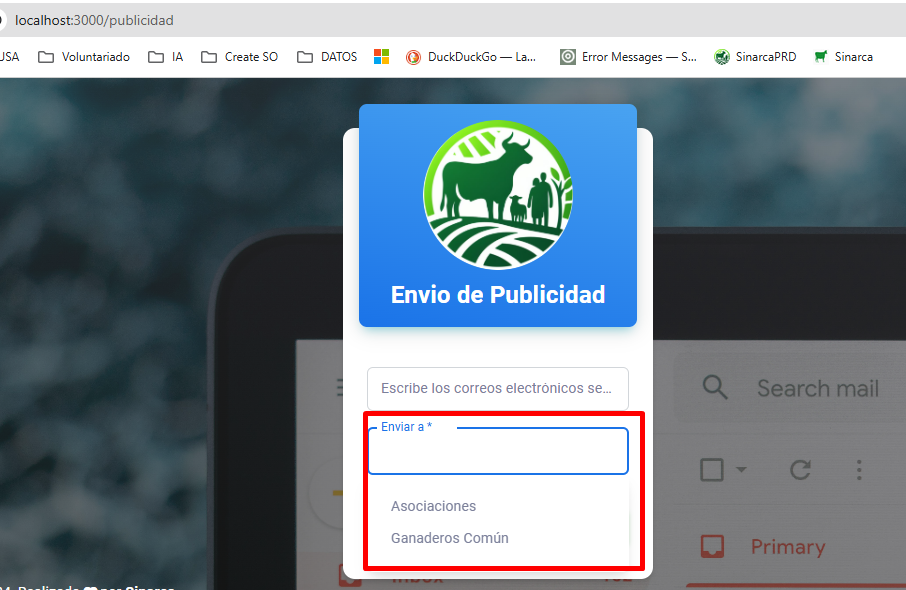

# Mejora Envio de Correos Publicidad

## Requerimiento:

Se requiere mejorar el envio de correos para que sea Masivo y ajustes para invitación de ganaderos particulares

## Alcance / Objetivo:
- Mejorar y optimizar el envio de correos por publicidad 

## Rama:

- Main 

## Ajustes Modelo de Base de datos

- Sin ajustes de Baseds de Datos

## Requerimientos/Módulos Afectados

### FrondTend
- Publicidad
- Versión V.1.4.5
### Backend 
- enviar_correos_publicidad.py
- Recepcion_correos_landing_page.py

## Resultado Esperado / Modo de Funcionamiento:

- El usuario debe seleccionar a que tipo de usuario se va enviar el correo

- los correos van separados por (,) coma para realizar el envio masivo

- Nota:  Solamente se permite 500 correos día, los correos deben validarse previamente que no tengan caracteres especiales

