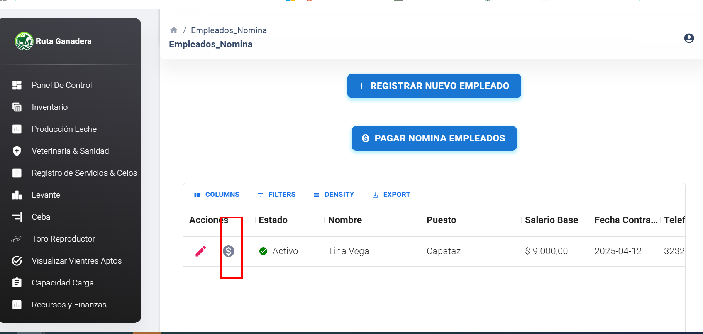
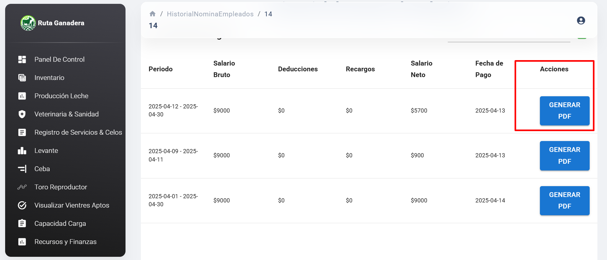
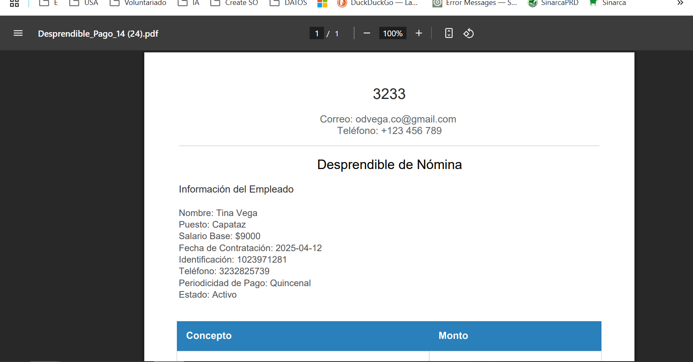

# 🛠️ Mejora: Generador de PDF en el Módulo de Nómina

## 📌 Requerimiento

El usuario necesita la funcionalidad para generar un **desprendible de nómina en formato PDF**, con el fin de entregar esta información de manera formal a los empleados.

## 🎯 Alcance / Objetivo

Implementar una opción dentro del módulo de Nómina que permita generar automáticamente un archivo PDF con los datos del empleado y los detalles del pago, incluyendo información relevante tanto del colaborador como del empleador.

## 🌿 Rama

- `main`

## 🗃️ Ajustes en el Modelo de Base de Datos

- No se requiere modificar la estructura de la base de datos.

## 📦 Módulos / Requerimientos Afectados

- Módulo de Nómina dentro del área de **Recursos Humanos y Finanzas**.
- actualizar a la versión del fronTend **V.1.5.9**
## ✅ Resultado Esperado / Funcionamiento

Dentro del módulo de empleados y nómina, el usuario podrá visualizar los pagos realizados:

Se ha habilitado un botón que permite **generar y descargar el PDF** correspondiente al desprendible de nómina:

La función encargada de generar el archivo PDF recoge automáticamente los datos del empleado y del empleador para generar un documento formal y bien estructurado:

