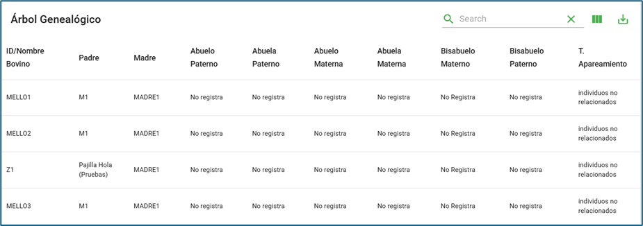
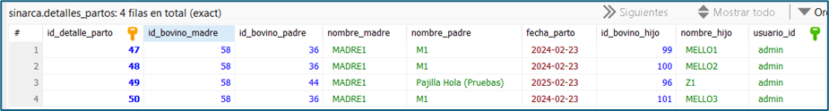
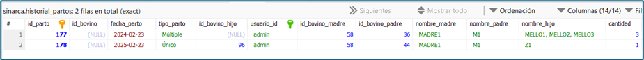
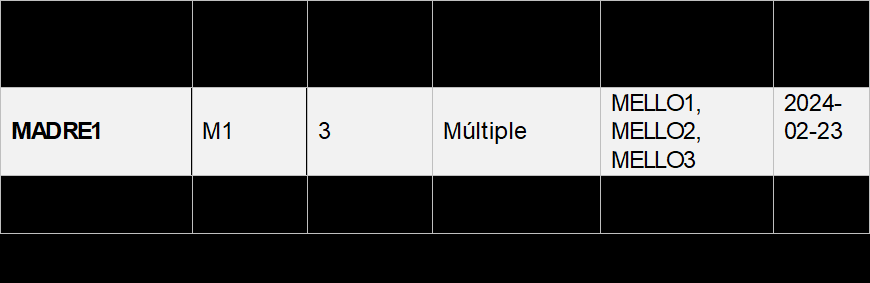

# Nuevo desarrollo: Partos Múltiples
## Requerimiento:
Se requiere crear manejar o identificar partos múltiples en animales.
### Alcance / Objetivo:
•	Modificar las funciones relacionadas a registro de partos para manipular o crear un registro de partos múltiples.

Ajustes Modelo de Base de Datos:

•	Se proponen los siguientes ajustes requeridos en las siguientes tablas:

historial_partos: la cual se le añade los siguientes campos:

*cantidad:* indica el número de animales nacidos en ese parto.

*tipo_parto:* Indica si el parto es Único (un solo bovino parido) o Múltiple (2 o más animales en un solo parto), este campo existía desde antes, solo que no se utilizaba

•	Adicionalmente, se crea una tabla intermedia donde se registran los detalles de los partos (esta tabla NO debe ser visualizada por el usuario).

#### detalles_partos:
id_detalle_parto: Llave primaria

id_bovino_madre: indicador de la madre (en caso de este registrada)

id_bovino_padre: indicador de la madre (en caso de este registrada)

nombre_madre

nombre_padre

fecha_parto

id_bovino_hijo

nombre_hijo

usuario_id

## Requerimientos/Módulos Afectados:
1.	Librerías Modificadas: Scripts
•	Se modifica la función y librería “registro_partos_animales.py”, adicionalmente, no se modificaron API
## Funcionamiento:
El usuario crea los registros desde árbol genealógico:

##### En este caso, observemos que los animales “MELLOS” comparten mismo padre, misma madre y nacieron el mismo día (Estas son las condiciones para que se consideren animales de un mismo parto, caso contrario, el sistema no los reconocerá como animales del mismo parto).***

El animal Z1 nació un día diferente. 

El paso siguiente, es llamar cualquier API que contenga la función “registro_partos_animales(session=db, current_user=current_user)”, luego de esto, los partos se cargarán automáticamente a través del registro de árbol genealógico:

Primero se cargarán en la tabla “detalles_parto”:

###### Nota: esto solo es una tabla intermedia, el usuario no debe poder visualizarla o modificarla, en esta tabla se cargarán los datos individuales de los bovinos.

A partir del registro de esta tabla, se cargarán los registros en “historial_partos”, tomando en cuenta lo siguiente:

Si existen dos o mas animales que compartan la misma a madre, el mismo padre y la misma fecha de nacimiento, entonces serán considerados como un parto múltiple, caso contrario será considerado un parto único de un solo animal parido:

##### Se recomienda que los campos a mostrar al usuario y su orden de visualización sea el siguiente:

