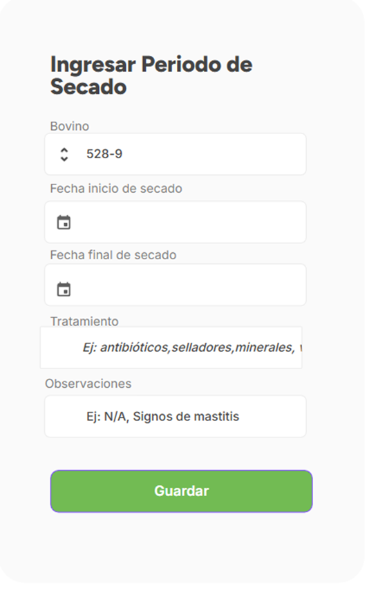

# Nuevo desarrollo: Creación registro de periodos de secado  

## Requerimiento:

Se requiere crear un registro donde el usuario pueda ingresar los periodos de secado de sus bovinos de leche.

## Alcance / Objetivo:

•	Crear un registro de periodos de secado para el usuario

## Ajustes Modelo de Base de datos

•	Se proponen los siguientes ajustes requeridos en las siguientes tablas:
periodos_secado: la cual posea los siguientes datos:

id_bovino
nombre_bovino
fecha_inicio_secado
fecha_final_secado
tratamiento
duracion
observaciones

## Requerimientos/Módulos Afectados

## Nueva Librerías: Scripts
Se crea un nuevo script en routes llamado “Periodos_secado.py” el cual contiene las API de crear registros, editar registros, listar y eliminar registros.

Se crea un nuevo script en Lib llamado “duracion_secado” el cual contiene una función que determina la duración del secado en base a los datos suministrados por el usuario.

## Resultado Esperado / Modo de Funcionamiento:

El usuario crea un registro

El registro es creado y se calcula la duración

#### Nota: Los campos de fecha final de secado, tratamiento y observaciones son opcionales, por lo tanto, si no existen las dos fechas, simplemente no se calculará la duración.

Así mismo se puede editar o eliminar los registros

# Mockups

