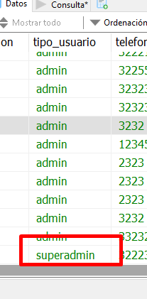
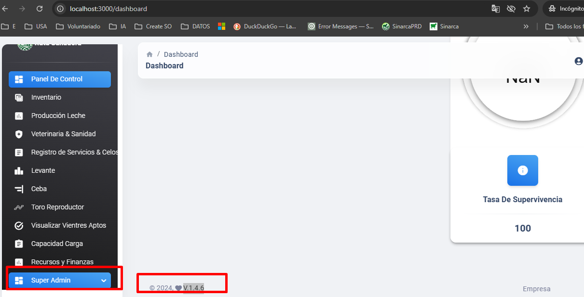

# Mejora: Creación De Super Usuario
## Requerimiento:

Se necesita implementar la funcionalidad para que los administradores puedan visualizar los usuarios recién registrados en la plataforma, junto con los indicadores asociados a cada uno. Además, se debe habilitar la opción para que los administradores puedan actualizar su estado a "superadmin".

Para los administradores de la cuenta actulizar el estado de admin a  superadmin
``UPDATE usuarios  
SET `tipo_usuario` = 'superadmin'  
WHERE usuario_id = ''; `` 

## Alcance / Objetivo:

Para el desarrollo solamente lo pueden ver los usuarios que tengan el rol de superusuario

## Rama:

 - Backend: master
 - Frontend: Version Estable (V.1.4.6)

## Ajustes Modelo de Base de datos

- Aplicar el parche Ajuste_db_1.3.9.sql para la creación y actualización de todos los usuarios como admin.

## Requerimientos/Módulos Afectados

- Nuevo Módulo: Super Admin (Frontend)
- Backend: Actualización de rutas_bovinos.py con nuevas APIs para la integración del rol de superusuario.

## Resultado Esperado / Modo de Funcionamiento:

Al actualizar un usuario al rol de superadmin, deberá reflejarse correctamente en la base de datos. 

- El Frontend debe estar en la versión V.1.4.6 para habilitar los privilegios de superadmin. 

